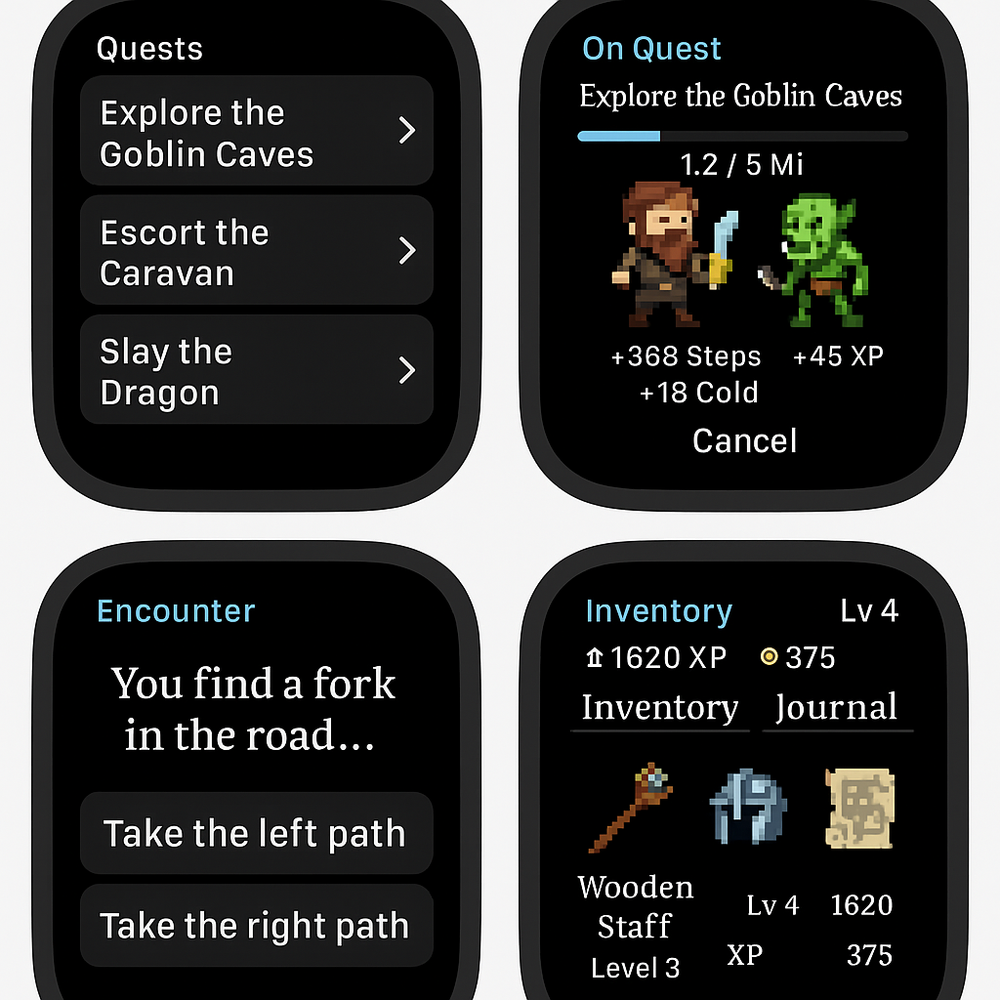

# Wrist Quest

  

A fantasy RPG adventure designed specifically for ****watchOS****. Explore a magical world, battle creatures, and level up your hero — all powered by your real-world activity.

  

---

  

## Table of Contents

  

- [Concept Overview](#concept-overview)

- [Core Gameplay Loop](#core-gameplay-loop)

- [Key Features](#key-features)

- [Target Audience](#target-audience)

- [Character Classes](#character-classes)

- [UI Sketches](#ui-sketches)

- [Data Models](#data-models)

- [Stretch Features](#stretch-features)

  

---

  

## Concept Overview

  

****Genre:**** Fantasy RPG / Idle Adventure  

****Platform:**** watchOS (optional iOS companion app)  

****Summary:**** Wrist Quest combines real-world movement and health data with light RPG mechanics. Walk to travel, stand to gain XP, and complete quests on the go.

  

---

  

## Core Gameplay Loop

  

1. Choose a quest (e.g., “Explore the Goblin Caves”).

2. Your real-world steps, standing hours, and heart rate progress your quest.

3. Encounter events:

   - Decision points

   - Combat events

   - Loot or discovery

4. Gain XP, loot, and new quests.

5. Level up and customize your character.

  

---

  

## Key Features

  

****Micro Sessions:****  

- Fast interactions (< 30 seconds).  

- Optimized for quick glances using the Digital Crown.

  

****HealthKit Integration:****  

- Steps = Travel Distance  

- Stand Hours = XP Bonus  

- High Heart Rate = Combat Mode  

- Exercise Minutes = Potions or Crafting Materials

  

****Gear and Loot:****  

- Found randomly during quests or encounters.  

- Equipment enhances performance or unlocks bonuses.

  

****Lore Journal:****  

- Tracks completed quests, discoveries, and notable NPCs.  

- Builds a fantasy codex over time.

  

---

  

## Target Audience

  

- Apple Watch users who enjoy fantasy or role-playing games.

- Fitness-minded users looking for gamification.

- Fans of idle/incremental games.

  

---

  

## Character Classes

  

| Class   | Passive Perk                  | Active Ability                | Special Trait                             |

|---------|-------------------------------|-------------------------------|-------------------------------------------|

| Warrior | Bonus XP for steps            | "Battle Roar": Double XP      | More likely to trigger combat events      |

| Mage    | Auto-completes minor events   | "Mana Surge": Auto-travel     | Higher item drop rates                    |

| Rogue   | Reduced quest distance        | "Shadowstep": Skip encounter  | Critical loot upgrades                    |

| Ranger  | Bonus XP when walking outdoors| "Hawk Vision": Preview events | Finds more gold during quests             |

| Cleric  | Heal via mindful minutes      | "Divine Light": Cleanse debuffs | Prevents failed outcomes 1x/day        |

  

---

  

## UI Sketches

  

> Concept Art (4 Screens):  

> Quest selection, encounter decisions, character stats, loot drops.

  

****Image Preview:****  


  

---

  

## Data Models

  

### Player

```swift

struct Player {

    let id: UUID

    var name: String

    var level: Int

    var xp: Int

    var gold: Int

    var stepsToday: Int

    var activeClass: HeroClass

    var inventory: [Item]

    var journal: [QuestLog]

}

```

  

### HeroClass

```swift

enum HeroClass: String {

    case warrior, mage, rogue, ranger, cleric

}

```

  

### Quest

```swift

struct Quest {

    let id: UUID

    var title: String

    var description: String

    var totalDistance: Double

    var currentProgress: Double

    var isCompleted: Bool

    var rewardXP: Int

    var rewardGold: Int

    var encounters: [Encounter]

}

```

  

### Encounter

```swift

enum EncounterType {

    case decision, combat, discovery, trap

}

  

struct Encounter {

    let id: UUID

    var type: EncounterType

    var description: String

    var options: [EncounterOption]

    var result: EncounterResult?

}

```

  

### EncounterOption

```swift

struct EncounterOption {

    var text: String

    var successChance: Double

    var result: EncounterResult

}

```

  

### EncounterResult

```swift

struct EncounterResult {

    var xpGain: Int

    var goldGain: Int

    var itemReward: Item?

    var healthChange: Int

    var message: String

}

```

  

### Item

```swift

enum ItemType {

    case weapon, armor, trinket, potion, misc

}

  

struct Item {

    let id: UUID

    var name: String

    var type: ItemType

    var level: Int

    var rarity: Rarity

    var effects: [ItemEffect]

}

```

  

### ItemEffect

```swift

struct ItemEffect {

    var stat: AffectedStat

    var amount: Int

}

  

enum AffectedStat {

    case strength, agility, intelligence, xpGain, healthRegen

}

```

  

### QuestLog

```swift

struct QuestLog {

    let questId: UUID

    let questName: String

    let completionDate: Date

    let summary: String

    let rewards: (xp: Int, gold: Int)

}

```

  

### HealthData (for HealthKit integration)

```swift

struct HealthData {

    var steps: Int

    var standingHours: Int

    var heartRate: Double

    var exerciseMinutes: Int

    var mindfulMinutes: Int

}

```

  

---

  

## Stretch Features (Future Ideas)

  

- AI-powered dynamic encounter generation (e.g., GPT-based event text).

- AR loot reveals (iOS / Vision Pro).

- Magical pet companions tied to your activity level.

- Multiplayer raids or guild quests.

- Subclass evolutions at higher levels.

  

---

  

## Status

  

****Prototype Stage:****  

- [ ] UI complete  

- [ ] Core logic mapped  

- [ ] HealthKit integration started  

- [ ] Initial quest & encounter data created

  

---

  

## License

  

MIT (or TBD)

  

---

  

## Credits

  

Concept and design by [Your Name]  

Mockup art generated with AI  

Special thanks to Apple’s watchOS dev tools + HealthKit

  

---
